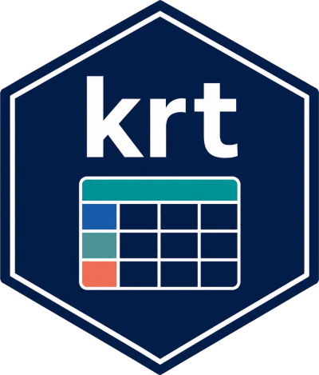

# krt 

<!-- badges: start -->
[](https://CRAN.R-project.org/package=krt)
[](https://github.com/choxos/krt/actions/workflows/R-CMD-check.yaml)
[](https://choxos.github.io/krt/)
[](https://app.codecov.io/gh/choxos/krt)
[](https://lifecycle.r-lib.org/articles/stages.html#experimental)
[](https://www.gnu.org/licenses/gpl-3.0)
[](https://doi.org/10.5281/zenodo.21398444)
<!-- badges: end -->

**krt** is a toolkit for authoring, validating, enriching, rendering, and
depositing **Key Resources Tables (KRTs)**: structured tables that list the
resources a study used and generated (antibodies, cell lines, organisms,
chemicals, software, datasets, protocols, and more), each paired with a
persistent identifier so that every resource is unambiguously identifiable and
machine-actionable.

KRTs began in Cell Press STAR Methods and are now required by funders such as
ASAP (Aligning Science Across Parkinson's). Once journals began requesting
structured resource identifiers, reported analyses of RRID adoption found the
fraction of antibodies a reader could unambiguously identify rose sharply, from
roughly a quarter to nearly all.

krt is a *standards orchestrator, not a template copier*: it models resources
around a neutral, typed core schema and maps them to journal or funder output
profiles. The author-facing table is a *view*; the underlying record set stays
structured, typed, and losslessly round-trippable through JSON and YAML.

## Installation

```r
# install.packages("pak")
pak::pak("choxos/krt")
```

## Quick start

```r
library(krt)

k <- new_krt("My study", study_type = "wet-lab")
k <- add_resource(k, "Antibody", "Rabbit Anti-TH",
                  vendor = "Millipore", catalog_number = "AB152",
                  rrid = "RRID:AB_390204", new_or_reuse = "reuse")
k <- add_resource(k, "Software/code", "Fiji", version = "2.14.0",
                  rrid = "RRID:SCR_002285", new_or_reuse = "reuse")

# Validate against a profile (ASAP is strict about identifiers)
validate_krt(k, profile = "asap")

# Normalize identifiers, then export to the ASAP six-column CSV
k <- normalize_ids(k)
export_krt(k, file.path(tempdir(), "resources.csv"), format = "asap")

# Or render a Markdown resource table for a manuscript
cat(render_krt(k, format = "md"))
```

## What krt does

- **Author** typed resource records with a neutral core schema (14 ASAP resource
  types; identifiers stored by type, never conflated).
- **Validate** structurally and semantically, with conditional packs for cell
  lines (authentication and mycoplasma), organism metadata, software
  reproducibility, and human-subject ethics/consent. These are minimal,
  honestly scoped checks, not full ICLAC or ARRIVE assessments. Severity is
  tunable per profile.
- **Normalize** identifiers offline and **optionally resolve** them online (RRID,
  DOI, ORCID, PubMed, ROR, Cellosaurus), degrading gracefully when offline.
- **Import** from CSV, TSV, Excel, JSON, YAML, the ASAP six-column format, and
  Cell Press STAR three-column tables.
- **Export and render** to JSON/YAML (lossless), CSV/Excel/ASAP, RIS/BibTeX
  (with explicit lossy-export warnings), and Markdown/HTML/Word.
- **Profiles**: `generic`, `asap` (CC BY 4.0 assets), `star-methods`
  (interoperability), and your own; with programmatic license and attribution
  introspection (`krt_audit_licenses()`).
- **Redact** ethics and consent metadata for public-audience exports and all
  deposits (author exports are unredacted).
- **Extract** resources from manuscripts (PDF, JATS, DOCX, text) with a
  deterministic regex engine or an optional LLM.
- **Deposit** to Zenodo or Figshare, and connect to eLabFTW and protocols.io.
- **Provenance**: each editing step is recorded and exportable as PROV-JSON and
  RO-Crate 1.1.
- **Interfaces**: an R API, a command-line tool, a Shiny editor
  (`launch_krt()`), and an RStudio addin.
- **Extensible** through a plugin SDK (`krt_plugin_api()`) and
  Bioconductor-friendly via an S4 adapter.

## Profiles and licensing

The package code is licensed **GPL-3**. The bundled ASAP profile assets are
derived from the ASAP Key Resource Table resources
([doi:10.5281/zenodo.17917979](https://doi.org/10.5281/zenodo.17917979), CC BY
4.0) and are isolated under `inst/extdata/profiles/asap/` with attribution and
provenance. This package is independently developed and is **not** an official
ASAP product; no endorsement by ASAP is implied. The STAR Methods profile
contains only independently written rules; no Cell Press template is bundled.
See `LICENSE.note`, `inst/COPYRIGHTS`, and `krt_audit_licenses()`.

## Use of AI

Parts of this package were developed with the assistance of AI coding tools. All
code was reviewed and tested by the author. The optional LLM extraction engine
sends manuscript text to a third-party provider only when the user explicitly
runs it with their own API key; the deterministic regex engine is the default
and runs entirely offline.

## Citation

```r
citation("krt")
```

## License

GPL-3 for the package code; see `LICENSE.note` and `inst/COPYRIGHTS` for the
licensing of bundled third-party materials.
